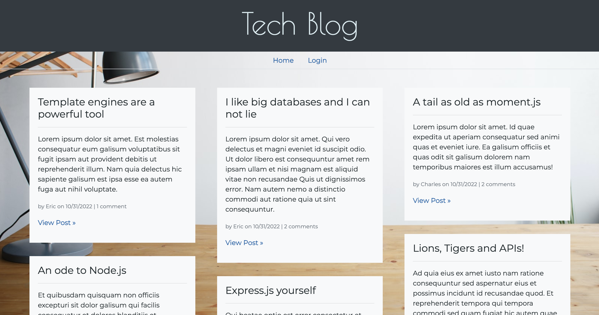
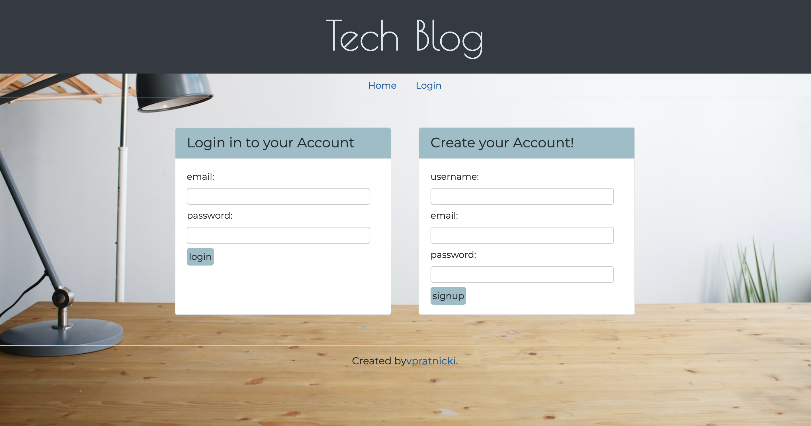
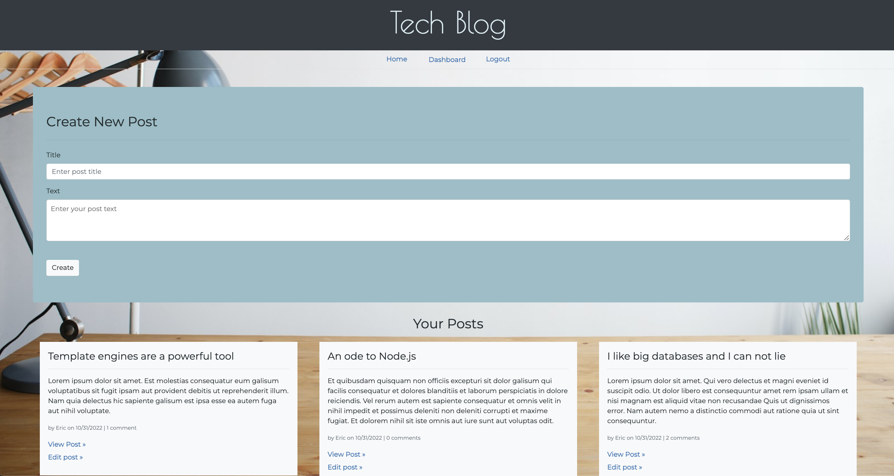
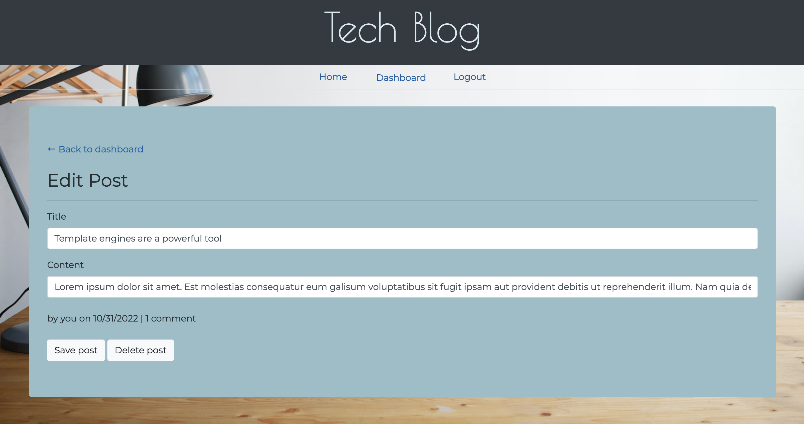

# Tech Blog

## Description

Tech Blog is a CMS-style blog site similar to a Wordpress site, where developers can publish their blog posts and comment on other developers’ posts as well. This site was biult completely from scratch and deployed to Heroku. This app follows the MVC paradigm in its architectural structure, using Handlebars.js as the templating language, Sequelize as the ORM, and the express-session npm package for authentication.

## Table of Contents

- [Installation](#installation)
- [Usage](#usage)
- [Contributing](#contributing)
- [Tests](#tests)
- [Questions](#questions)

## Installation

The following steps are how to install and set up the blog: 
1. Clone the repo: https://github.com/vpratnicki/tech-blog.git
2. Install the following npm packagess: 
    - express
    - express-handlebars
    - express-session
    - mysql2
    - connect-session-sequelize
    - sequelize
    - dotenv
    - bcrypt

## Usage

To use this app, install the list of packages above, and run 'npm start' to start the server from the comand line. View http://localhost:3001/ to access the  site, create a login and create posts and comments. 
- A logged in user has access to the dasboard where they can create new posts, edit their past posts and comment on other posts.
- If a user is not logged in they have view only access. 

### [View Deployed app »](https://safe-citadel-76816.herokuapp.com/) 

### Screenshots

## Contributing 

Contributions are greatly appreciated! In fact, they are what makes this open source community such a wonderful place to learn, develop, and create. I welcome all suggestions that would make this project better, please fork the repo and create a pull request. Additionally you can open an issue with the tag "enhancement". 

Fork the Project: 
1. Create your feature branch (git checkout -b feature/awesome-feature). 
2. Commit your changes (git commit -m 'Add some awesome feature').  
3. Push to the branch (git push origin feature/awesome-feature),  
4. Open a Pull Request.

## Tests

Testing is key to making code maintainable, this app was biult using Jest. To run the test: 
1. Install NPM package: npm install --save-dev jest 
2. Enter npm test in the comand line.

## Questions

Have any questions about this project? Please reach out! 

- GutHub username: vpratnicki
- Link: [https://github.com/vpratnicki](https://github.com/vpratnicki)
- Email: vanessa@pratnicki.net